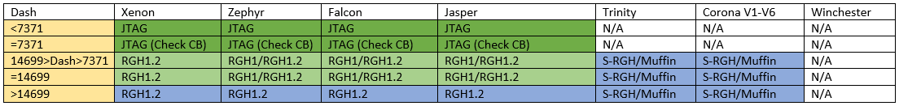

## Why Mod your console

## Identifying your console

You'll need to gather some information about your console before you begin in order to determine what mods you will be doing.

[Identifying your Model](identifyconsole/model.md)

[Identifying your Motherboard](identifyconsole/motherboard.md)

[Identifying your Disk Drive](identifyconsole/dvddrive.md)

[Identifying your Dashboard](identifyconsole/dashboard.md)

## Choosing your mods

Now that you've identified important information about your console, it's time to decide on what mods you'll do.

##### [Disk Drive Flashing](oddflashing.md)

Flashing an Xbox 360 DVD drive involves overwriting the DVD drive  firmware with a custom firmware (usually LT3) that allows the running of burned DVDs. With this you can play some game mods, so long as they are running signed XEX files, as this mod does not allow running unsigned code by itself. This can be done with as little as a USB device, but may range in materials and difficulty, up to and including drilling into a chip with a very small dremel tool (known  as the "kamikaze" hack). This allows you to play game backups and some game mods on your Xbox 360. You can play on Xbox Live with relatively low risk of being banned as long as you stealth patch your games. This can be done with any Phat model drive and most Slim and E consoles. Refer to the tutorial for more information.

##### [Disk Drive Emulator](odes/index.md)

An Optical Drive Emulator is a device that allows you to run game backups on a Xbox 360, without requiring a jailbroken  console or custom dashboard. The majority of consoles are compatible, with some newer slims requiring the console to be RGH exploited to function correctly, and the newest motherboards (Winchester) not being compatible. Please refer to your ODE of choice for compatibility information, functionality, and safety on Xbox Live.

##### "Jailbreak" Mods

These are where the system is modified to run unsigned code. This includes [RGH](rgh/index.md)/[JTAG/SMC](jtag-smc/index.md)/[R-JTAG](rjtag/index.md)/[R-JTOP](rjtop/index.md). Often, people will install a freeboot image to NAND, some essential utilities, a custom dashboard, and homebrew. These mods will allow you to play modified game backups and do much much more with your console. Refer to the following chart to determine which you should do:

##### [King Kong Shader Exploit](kkexploit.md)

This is an older exploit only available on very old kernel/dashboard versions and is only useful to run Linux and cannot modify the Xbox 360 Operating System in any functionally useful manner. Aside from running Linux on your own console, this exploit is entirely useless and only listed for historic reasons.

Now that you know which mod you want to do, follow their respective tutorials and return here once you are finished.

## Installing Games, Apps, and DLC

## Playing on Xbox Live

## Custom Boot Animations

## [Modding Gamesaves](savegamemodding/index.md)

## [Modding Games](gamemodding/index.md)

## Working with the Filesystem

## Introduction to XeLL

## Backing up Games

## Installing the Hacked Compatibility Files

## Dumping NAND

## Updating system

[Installing Linux](development/installlinux.md)

# Recommended Setup

------

This page will lead you through the basic setup of your console and [/u/Derf_Jagged](https://www.reddit.com/u/Derf_Jagged)'s recommendations of what to install. This list assumes that you have a freshly JTAG/RGH exploited console. 

------

1. If you have an early phat model, check the [cooling improvements page](https://www.reddit.com/r/360hacks/wiki/improve_cooling) for ideas to lower your system temperatures. 
2. [Disable the eFuse Burning Circuit](https://old.reddit.com/r/360hacks/wiki/efuses) so that you never have to worry about accidentally updating your system with an official update.
3. [Save a backup dump of your NAND and KV info](https://www.reddit.com/r/360hacks/wiki/nand_backup) to somewhere safe if you don't already have one. 
4. [Install XeXmenu](https://old.reddit.com/r/360hacks/wiki/XeXmenu). 
5. [Install Aurora](https://www.reddit.com/r/360hacks/wiki/aurora) and set paths to scan for games. Keep XeXmenu installed as a backup.
6. Install DashLaunch and:
   - Set target temperatures for fans to 60°C for CPU/GPU/EDRAM.
   - Set `default` to your Aurora XEX so it loads Aurora on bootup.
   - Set `X` to boot to the Microsoft dashboard XEX (located in flash).
   - [Block XBL](https://www.reddit.com/r/360hacks/wiki/block_xbl) if you don't plan on playing online.
7. [Modify your bootanim](https://www.reddit.com/r/360hacks/wiki/bootanim) if you want to customize your boot up animation and sound.
8. Install apps:
   - For emulating non-Xbox games: [Various Emulators](https://www.reddit.com/r/360hacks/wiki/emulators)
   - For activating locked DLC or games: [XM360](https://www.reddit.com/r/360hacks/wiki/xm360)
9. If you want to mod games, install [Xbox Neighborhood](https://www.reddit.com/r/360hacks/wiki/xbox_neighborhood) and see [this page for specific game mods](https://www.reddit.com/r/360hacks/wiki/modding).
10. Set up LiNK and/or [XLink Kai](https://www.reddit.com/r/360hacks/wiki/xlink) for system link play.

## Credits

Orpheus for being super informative.