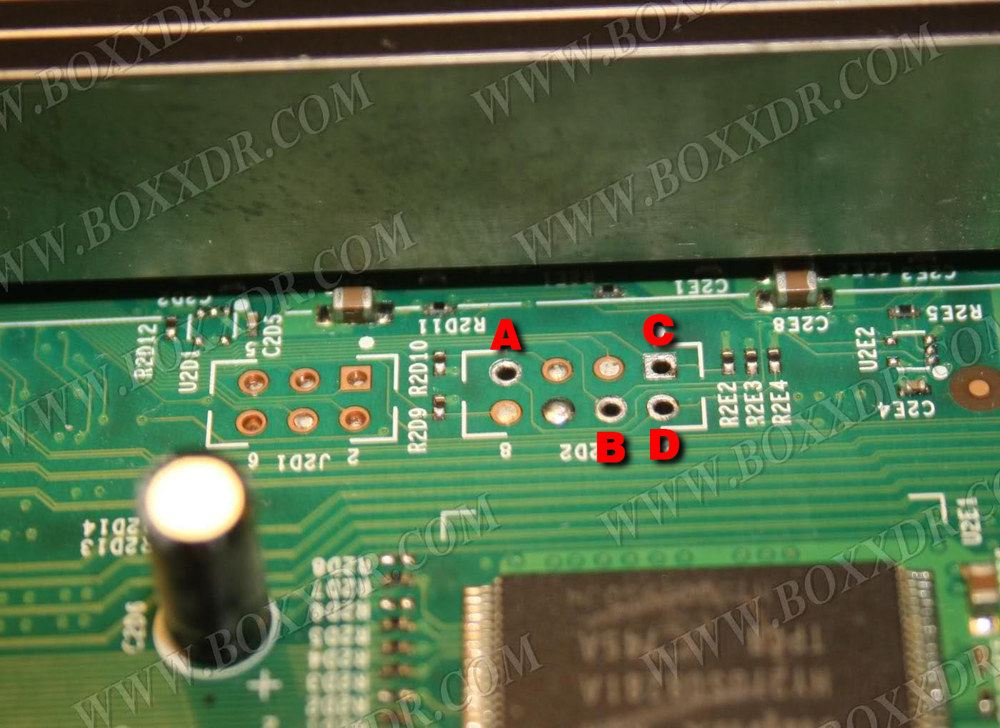
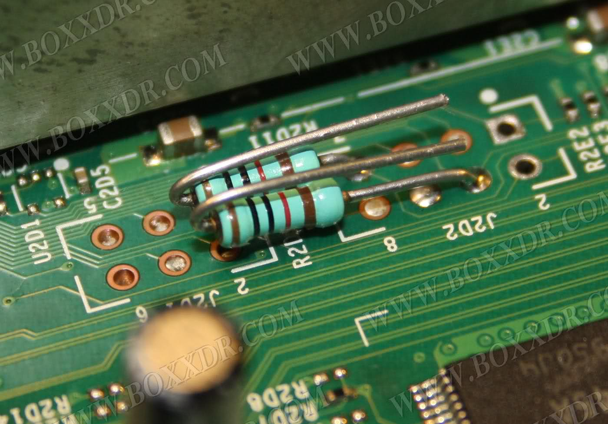
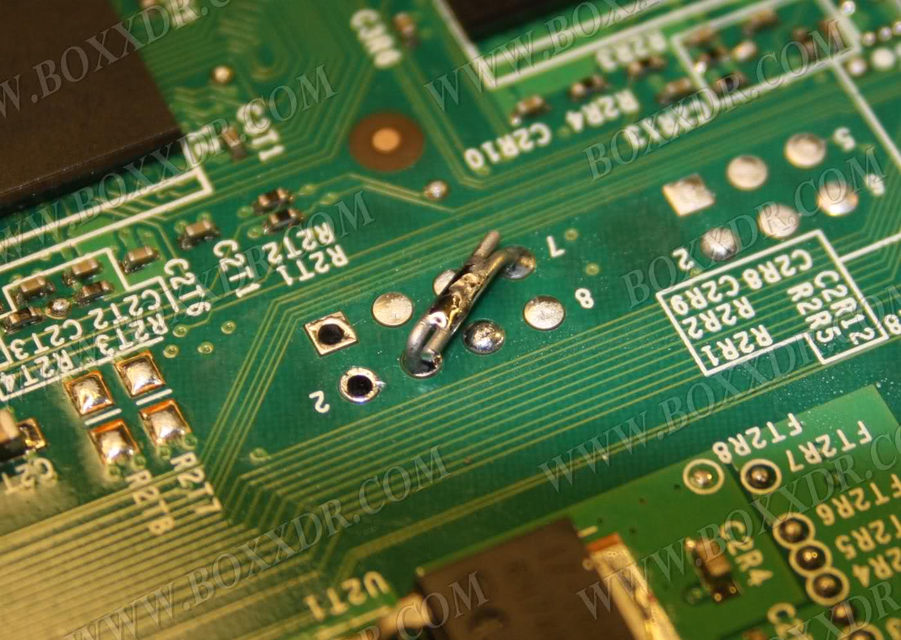
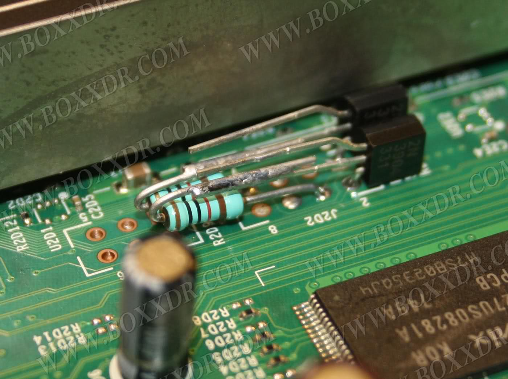
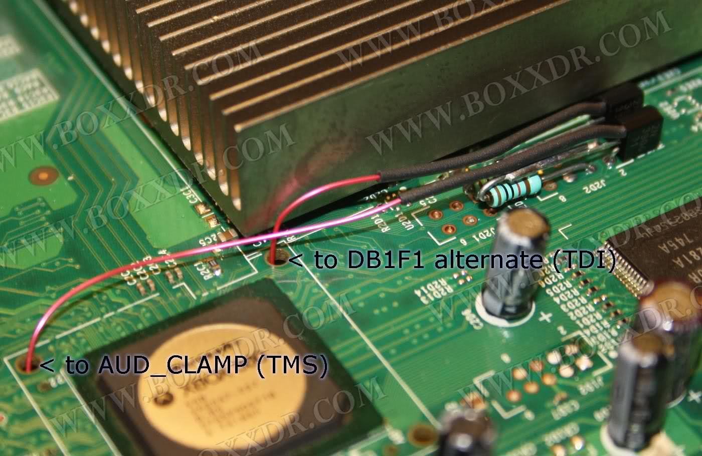
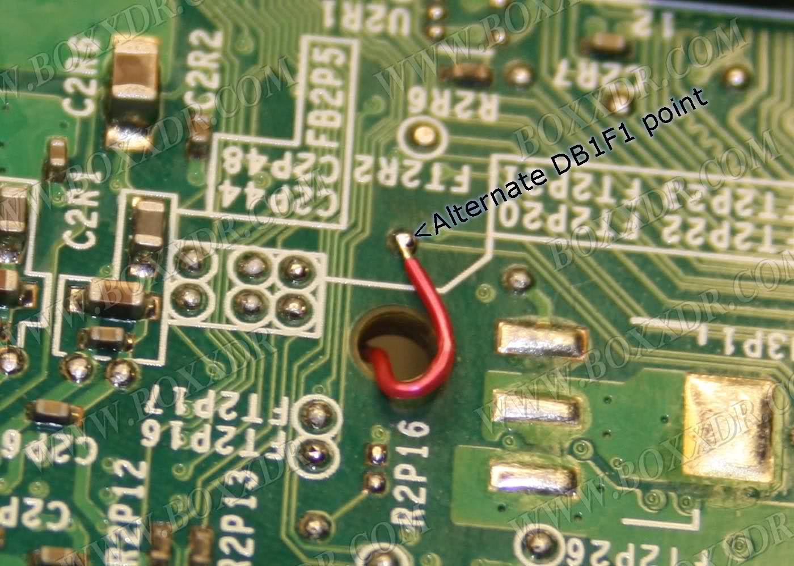

# JTAG / R-JTOP Wiring: Boxxdr Method

------

## Equipment Needed

- A soldering iron, solder, and flux
- Isopropyl alcohol (90% or higher recommended) and cotton swabs
- 28AWG or 30AWG wire
- Two 10K Ohm 1/2W or 1/4W resistors
- Two 2N3904 transistors
- Heat shrink tubing

## Motherboard Soldering

1. Bend the legs of the two resistors to match the image below and  solder them to points A and B by melting the existing solder and pushing the legs through. Ensure that there is enough of each leg underneath  the board so that they can be soldered together. 
2. Solder the legs together underneath the board, taking care to avoid them touching the other metal points on the board. 
3. Bend the bottom leg of one the transistors as shown in the image  below, making sure that the writing on the transistor faces away from  the heatsink. Solder the bottom leg to point C by melting the existing  solder and pushing the leg through. Solder the middle leg to the  resistor attached to point A. Repeat this process for the other  transistor and its respective resistor. 
4. Cut two long strands of wire, soldering one to each of the top  legs of the transistors. Cut a piece of heat shrink tubing long enough  to cover each of the top legs, then heat it using a hair dryer until it  stops shrinking. This will prevent accidental shorting of the wires. 
5. Feed the wires through the holes shown below, soldering them to  the respective points on the underside of the board. Ensure that your  wiring is correct and that the correct line is connected to each point. 

## Testing your Console

Once you've finished soldering, clean up any flux with isopropyl  alcohol and cotton swabs. Partially re-assemble your Xbox 360, ensuring  that:

- The motherboard in the metal cage
- Heatsinks are attached (if you removed them for some reason)
- Fans are in place and plugged in
- The white fan shroud is in place
- The Ring of Light board is plugged into the front of your console
- Your video cable (preferably not HDMI) is plugged in
- Your power brick is plugged in to both you wall and Xbox 360

Turn on your console, and it should boot into XeLL within a minute.  At this point, write down (and/or take a picture of) the "CPU Key"  listed on screen, and turn your console off. You can now go back to the  JTAG (or R-JTOP) hack page and continue from the beginning of the  "Creating an XeBuild Image" section.

- If your console doesn't boot into XeLL, check all previous steps and double check your wiring accuracy and quality. If you're convinced that your soldering and wiring is all perfect and it still doesn't boot, you receive E79 errors, or you have issues with HDMI; you may have a rare  console that needs the Boxxdr + Open_Tray method. Go back and choose  this method in the hack specific wiring section of the hack guide.

## Troubleshooting

- **Error: "could not read --_-----.bin (-1)"**
  - Try running JRunner as administrator
  - Make sure that the dashboard files are present in the xeBuild folder in the JRunner directory. It should just be a folder with the dashboard number.
  - Download the common bin pack and merge it with your common folder in the JRunner directory.
- **What should I do if I ripped off a soldering pad?**
  - Look online for an alternate point to solder onto. Practice more on junk electronics before attempting to continue.