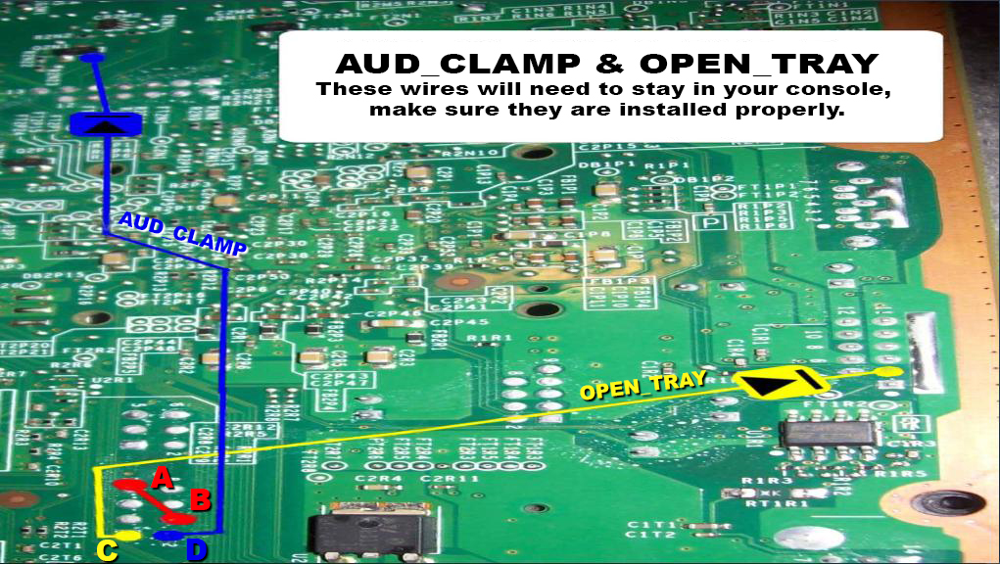
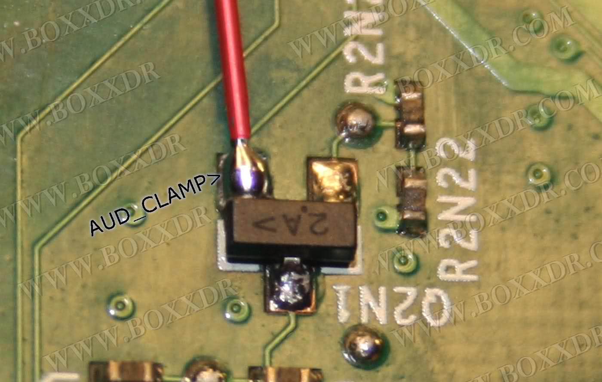

# JTAG / R-JTOP Wiring: Boxxdr + Open_Tray Method

------

## Equipment Needed

- A soldering iron, solder, and flux
- Isopropyl alcohol (90% or higher recommended) and cotton swabs
- 28AWG or 30AWG wire
- Two 10K Ohm 1/2W or 1/4W resistors
- Two 2N3904 transistors
- Heat shrink tubing

## Flashing a Different Dump

1. Download and extract the [Open_Tray bin pack](https://www.mediafire.com/file/y169u1he03mtheo/Open_Tray_Bins.zip/file). In Jrunner, select "..." next to the Source File field and navigate to the `Open_Tray Bins` folder and choose the `<model>.bin` file corresponding to your motherboard. In the upper right corner of  the window, select the dashboard version you chose for the patched dump  that you wrote to the motherboard and make sure that the "Jtag" radio  button is selected.
2. In the top left of the window, select the button labeled "Write  Xell-Reloaded". If it says "Device Not Found" or anything about missing  CB/CD files, see the troubleshooting steps at the bottom of this page.  If you get messages about bad blocks, ignore them. It may prompt you for your motherboard model again, make the correct choice and press OK. The progress bar will begin moving and stop when it reaches 03FF (or 1900  for a 256MB/512MB Jasper). This process will take ~3 minutes (~10  minutes for a 256MB / 512MB Jasper).
3. Once it has successfully written to the motherboard, unplug the  power cable from your Xbox 360 and unplug the USB cable from the  computer and programmer.

## Motherboard Soldering

1. On the underside of the motherboard, solder a wire from point A to B.
2. Solder a wire onto the non-striped side of the first diode.  Solder the striped end of the diode to the bottom right point of the  Q2N1 module as shown in the image below. Cut a length of heat shrink  tubing to cover all exposed metal of the diode and heat it with a hair  dryer until it stops shrinking. Solder the other end of the wire to  point D. 
3. Solder a wire onto the non-striped side of the second diode.  Solder the striped side of the diode directly to the right-most point in the image below. Cut a length of heat shrink tubing to cover all  exposed metal of the diode and heat it with a hair dryer until it stops  shrinking. Solder the other end of the wire to the left-most point  (point C in the diagram above). 

- It's recommended to use electric tape or hot glue to hold the wires down after installation. 

## Testing your Console

Once you've finished soldering, clean up any flux with isopropyl  alcohol and cotton swabs. Partially re-assemble your Xbox 360, ensuring  that:

- The motherboard in the metal cage
- Heatsinks are attached (if you removed them for some reason)
- Fans are in place and plugged in
- The white fan shroud is in place
- The Ring of Light board is plugged into the front of your console
- Your non-HDMI video cable is plugged in (for some reason XeLL sometimes won't boot with an HDMI cable)
- Your power brick is plugged in to both you wall and Xbox 360

Turn on your console, and it should boot into XeLL within a minute.  At this point, write down (and/or take a picture of) the "CPU Key"  listed on screen, and turn your console off. You can now go back to the  hack guide page and continue from the beginning of the "Creating an  XeBuild Image" section.

- If your console doesn't boot into XeLL, check all previous steps and double check your wiring accuracy and quality. Also make sure you are  using a non-HDMI cable, as XeLL doesn't seem to always boot with a HDMI  cable, but once your console is fully hacked you can swap the video  cable back out.

## Troubleshooting

- **Error: "could not read --_-----.bin (-1)"**
  - Try running JRunner as administrator
  - Make sure that the dashboard files are present in the xeBuild folder in the JRunner directory. It should just be a folder with the dashboard number.
  - Download the common bin pack and merge it with your common folder in the JRunner directory.
- **What should I do if I ripped off a soldering pad?**
  - Look online for an alternate point to solder onto. Practice more on junk electronics before attempting to continue.