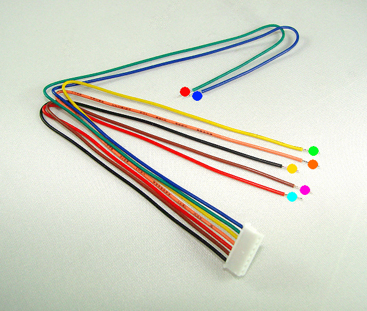
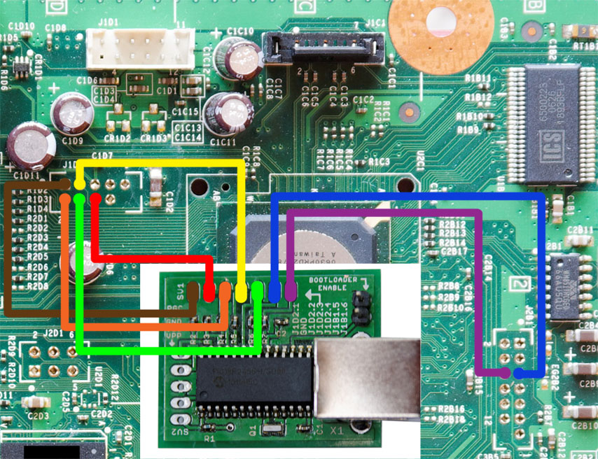
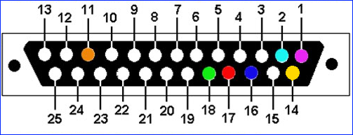

# NAND Dump: NAND-X / JR Programmer

------

This guide will walk you through obtaining NAND dumps, creating a  patched dump, and writing it to the console using a NAND-X or JR  Programmer. The process is the same for both programmers. Although JR  Programmer clones may work, you might want to [check if your JR Programmer is a clone](https://i.imgur.com/8Cx62zb.jpg) in case you expected an original and received a clone.

------

## Equipment Needed

- A NAND-X or JR Programmer
- A mini-USB to USB cable
- A soldering iron, solder, and flux
- Isopropyl alcohol (90% or higher recommended) and cotton swabs
- 28AWG or 30AWG wire

## Installing Drivers

1. Download and extract [JRunner](http://www.mediafire.com/file/lk6p034dx445fmd/TWM_Jrunner_Package.zip/file). 
2. Press Win+R and type `devmgmt.msc` and press Enter to  open Device Manager. You can also get to it by searching for it in the  Start menu. Plug the USB cable into both your programmer and your PC.  Windows should find it and it will appear as `J-R PROGRAMMER` or `NAND-X` under the "Other Devices" category in Device Manager.
3. If you are on Windows 10, you will need to [disable signed driver enforcement](https://360.consolemods.org/modguide/disabledriversigenforcement.html).
4. Right click the programmer's name and select Update Driver  Software... > Browse my computer for driver software > Browse...  > navigate to your JRunner folder > common > drivers > OK  > Next. You may receive a popup saying that Windows can't verify the  publisher of the driver, select the option to install it anyway. It  should successfully install and file your device under its own category  in Device Manager. Your programmer's LED light should also turn green.

## Soldering to the Motherboard

1. Your kit will come with a cable with a white plug on one end, and either open wires or single plastic connectors on the other end. Solder each wire according to [this diagram](https://i.imgur.com/H0UBur2.jpg) and the colored spots on the picture below. Note that the wire colors  may be different than the picture below. If this is the case, go off of  the wire position and not the color of the wires. 
2. Once you've finished soldering, clean up any flux with isopropyl alcohol and cotton swabs.

## Dumping the NAND

1. Plug your Xbox 360 power supply in, but **do not** turn the console on.
2. Plug the white end of the cable into the bottom port of the  programmer. Plug the mini-USB cable into the programmer and your PC. 
3. Download the files for the dashboard you wish to upgrade to (such as the [17526 Dashboard Files](http://www.mediafire.com/file/vx321lyc0ng2r51/17526_dash_Jrunner.zip/file)). It's recommended to use the latest dashboard, as older dashboards do  not support newer games. Extract the numbered folder into the `xeBuild` folder inside of the JRunner directory.
4. Launch JRunner. Select "Read Nand" in the top left. It may prompt you for your Xbox 360's model, make the correct selection and click OK. If everything is wired properly, it will read your NAND twice and  automatically compare the dumps. If it says "Device Not Found" or  anything about missing CB/CD files, see the troubleshooting steps at the bottom of this page. If you get messages about bad blocks, ignore them. When it has finished, it will tell you if the two dumps are an exact  match. If they are, you can close JRunner and proceed. If they aren't,  take more dumps until you get matching ones.
5. Copy one of the dumps to a safe place such as cloud storage or  send it to yourself in an email to keep it safe. Rename the other dump  to `nanddump1.bin` and move it to the `output` folder in the JRunner directory.

## Checking your CB

If you are on a dashboard below 7371, you can skip this section. If you are on dashboard 7371, you **must** to check to see if your CB is exploitable.

Open JRunner again and select "..." next to the Source File field and choose the `nanddump1.bin` file. On the right-hand side, note the value next to the `2BL [CB]` label. If your CB is on the list below, it is patched and your console is not JTAGable.

| Model       | Unexploitable CB Versions    |
| ----------- | ---------------------------- |
| Xenon       | 1922, 1923, 1940, 7373       |
| Zephyr      | 4571, 4572, 4578, 4579, 4580 |
| Falcon/Opus | 5771                         |
| Jasper      | 6750                         |

## Modifying the Dump and Flashing

Now that you've verified that your CB is exploitable, we will modify the dump. 

1. In J-Runner, select "..." next to the Source File field and choose your `nanddump1.bin`. In the top right of the window, the dashboard version 17526 should be  in the dropdown menu next to "Dash Version". If not, select it from the  dropdown menu. 
   - If no dashboards are listed, you will need to download a dashboard , extract it to the XeBuild folder inside your JRunner directory, and  restart JRunner.
2. Select the `Jtag` radio button in the top right of the window. If your motherboard is **NOT** a Xenon, put a check in the "Aud_Clamp?" box.
3. In the top left of the window, select the button labeled "Write  Xell-Reloaded". If it says "Device Not Found" or anything about missing  CB/CD files, see the troubleshooting steps at the bottom of this page.  If you get messages about bad blocks, ignore them. It may prompt you for your motherboard model again, make the correct choice and press OK. The progress bar will begin moving and stop when it reaches 03FF (or 1900  for a 256MB/512MB Jasper). This process will take ~3 minutes (~10  minutes for a 256MB / 512MB Jasper).
4. Once it has successfully written to the motherboard, unplug the  power cable from your Xbox 360 and unplug the USB cable from the  computer and programmer.
5. Go back to the [JTAG Hack page](https://360.consolemods.org/modguide/jtag-smc/index.html) and continue at the start of the JTAG-Specific wiring section.

## Troubleshooting

- **"Device Not Found" while dumping**
  - Check that your power brick is plugged in, with an amber colored  LED, and that it is plugged into your console completely (console turned off).
  - Check your soldering on both the motherboard and your programmer.  Each point should be solidly connected so that a tug on the wire won't  disconnect the wire.
  - Check that you've cleaned up any flux you had used. Depending on the type, it may be conductive and cause issues.
- **Errors about missing CB/CD files**
  - Try downloading [this bootloader pack](https://www.mediafire.com/file/3jbjey3mqx73qrb/Xbox_360_Bootloader_Files.zip/file) and extract the files into the `common` folder in your JRunner directory.
- **What should I do if I ripped off a soldering pad?**
  - Look online for an alternate point to solder onto. Practice more on junk electronics before attempting to continue.

# NAND Dump: Matrix USB NAND Flasher Method

------

This guide will walk you through obtaining NAND dumps, creating a  patched dump, and writing it to the console using a Matrix USB NAND  Flasher (also known as a MTX SPI NAND Flasher).

------

## Equipment Needed

- Matrix USB NAND Flasher
- A mini-USB to USB cable
- A soldering iron, solder, and flux
- Isopropyl alcohol (90% or higher recommended) and cotton swabs
- 28AWG or 30AWG wire

## Soldering to the Motherboard

1. Solder a wire to each of the J1D2.# and J2B1.# pads. The label  corresponds to what header they will attach to (J1D2 or J2B1) and which  pin on that header.
2. Solder the other ends of the wires to the corresponding points on the motherboard in the diagram below. 
3. Once you've finished soldering, clean up any flux with isopropyl alcohol and cotton swabs.

## Dumping the NAND

1. Download and extract [NandPro 3.0a](http://www.mediafire.com/file/2jujuawjhbb0za0/Nandpro30.rar/file). 
   - If you are using a 64-bit system, download [InpOutBinaries](http://www.mediafire.com/file/15y0sgsb5nm1pk6/InpOutBinaries_1501.zip/file) and extract it into the NandPro folder.
   - If you are using a 32-bit system, run `port95.exe` in the NandPro folder and install it.
2. Plug the USB cable into both the Matrix and your PC. Plug your Xbox 360 power supply in, but **do not** turn the console on.
3. Press the Windows key + R and type "cmd" and press enter. In the  Command Prompt, enter these commands. Replace the "16" with "64" if you  have a 256MB or 512MB Jasper.
   - `cd Desktop\Nandpro30`
   - `nandpro usb: -r16 original_nand1.bin`
4. Press Enter and it will start dumping the NAND. It will increment a hexadecimal counter, starting at address 0000 and ending at 03FF (or  1900 for a 256MB/512MB Jasper). If it says "Could not detect flash  controller!" or anything about missing CB/CD files, see the  troubleshooting steps at the bottom of this page. If you get messages  about bad blocks, ignore them. This will create a file called `original_nand1.bin` in NandPro folder. This process will take approximately 5 minutes for  regular consoles, ~30 minutes for 256MB/512MB Jaspers When it is  finished, type the command again, changing the name of the dump as  follows, with ## being either 16 or 64:
   - `nandpro usb: -r## original_nand2.bin`
5. Download and extract [JRunner](http://www.mediafire.com/file/lk6p034dx445fmd/TWM_Jrunner_Package.zip/file). Download the files for the dashboard you wish to upgrade to (such as the [17526 Dashboard Files](http://www.mediafire.com/file/vx321lyc0ng2r51/17526_dash_Jrunner.zip/file)). It's recommended to use the latest dashboard, as older dashboards do  not support newer games. Extract the numbered folder into the `xeBuild` folder inside of the JRunner directory.
6. Launch JRunner. Select `...` next to the Source File field and choose `original_nand1.bin`. Select "..." next to the Additional File field and choose `original_nand2.bin`. Press the "Nand Compare" button and it will list any bad blocks and  tell you if the two dumps are an exact match. If they are, you can close JRunner and proceed. If they aren't, take more dumps until you get  matching ones.
7. Copy one of the dumps to a safe place such as cloud storage or  send it to yourself in an email to keep it safe. Rename the other dump  to `nanddump1.bin` and move it to the `output` folder in the JRunner directory.

## Checking your CB

If you are on a dashboard below 7371, you can skip this section. If you are on dashboard 7371, you **must** to check to see if your CB is exploitable.

Open JRunner again and select "..." next to the Source File field and choose the `nanddump1.bin` file. On the right-hand side, note the value next to the `2BL [CB]` label. If your CB is on the list below, it is patched and your console is not JTAGable.

| Model       | Unexploitable CB Versions    |
| ----------- | ---------------------------- |
| Xenon       | 1922, 1923, 1940, 7373       |
| Zephyr      | 4571, 4572, 4578, 4579, 4580 |
| Falcon/Opus | 5771                         |
| Jasper      | 6750                         |

## Modifying the Dump

Now that you've verified that your CB is exploitable, we will modify the dump. 

1. In J-Runner, select "..." next to the Source File field and choose your `nanddump1.bin`. In the top right of the window, the dashboard version 17526 should be  in the dropdown menu next to "Dash Version". If not, select it from the  dropdown menu. 
   - If no dashboards are listed, you will need to download a dashboard , extract it to the XeBuild folder inside your JRunner directory, and  restart JRunner.
2. Select the `Jtag` radio button in the top right of the window. If your motherboard is **NOT** a Xenon, put a check in the "Aud_Clamp?" box.
3. In the top left of the window, select the button labeled "Create  Xell-Reloaded". Ensure that your motherboard model is selected, and  press OK. It will generate a `.bin` file (for example, `xenon.bin` or `jasper_hack_aud_clamp.bin`) in the `output` folder of your JRunner directory. 

## Flashing the Dump

1. Copy the generated `xxxxx.bin` (for example, `xenon.bin`) file into your Nandpro30 folder. Press the Windows key + R and type  "cmd" and press enter. In the Command Prompt, enter these commands,  replacing xxxxx with your file's name and replacing the "16" with a "64" if you are using a 256MB or 512MB Jasper:
   - `cd Desktop\Nandpro30`
   - `nandpro usb: -w16 xxxxx.bin`
2. Press Enter, and it will start writing the modified dump to your  motherboard. It will increment a hexadecimal counter, starting at  address 0000 and ending at 004F. If it says "Could not detect flash  controller!" or anything about missing CB/CD files, see the  troubleshooting steps at the bottom of this page. This process will take approximately 5 minutes for regular consoles, ~30 minutes for  256MB/512MB Jaspers.
3. Once it has successfully written to the motherboard, unplug the  power cable from your Xbox 360 and unplug the USB cable from the  computer and the Matrix.
4. Go back to the [JTAG Hack page](https://360.consolemods.org/modguide/jtag-smc/index.html) and continue at the start of the JTAG-Specific wiring section.

## Troubleshooting

- **"Could not detect flash controller!" while dumping**
  - Check that your power brick is plugged in, with an amber colored  LED, and that it is plugged into your console completely (console turned off).
  - Check your soldering on both the motherboard and Matrix. Each point  should be solidly connected so that a tug on the wire won't disconnect  the wire.
  - Check that you've cleaned up any flux you had used. Depending on the type, it may be conductive and cause issues.
- **Errors about missing CB/CD files**
  - Try downloading [this bootloader pack](https://www.mediafire.com/file/3jbjey3mqx73qrb/Xbox_360_Bootloader_Files.zip/file) and extract the files into the `common` folder in your JRunner directory.
- **What should I do if I ripped off a soldering pad?**
  - Look online for an alternate point to solder onto. Practice more on junk electronics before attempting to continue.

# NAND Dump: LPT Method

------

This guide will walk you through obtaining NAND dumps, creating a patched dump, and writing it to the console using a LPT cable.

------

## Equipment Needed

- A PC with a 25 pin LPT/printer port. Generally, this port is purple colored.
- A soldering iron, solder, and flux
- Isopropyl alcohol (90% or higher recommended) and cotton swabs
- 28AWG or 30AWG wire
- Five 100ohm 1/2W resistors
- A 1N914/4148 switching diode
- A 25-pin male D-sub connector. This can be taken from an old  parallel printer cable, but it will likely need to be taken apart to be  re-wired.
- (Recommended) A 25-pin D-sub connector hood. This will protect your  cable from possible shorts and make the cable more permanent. 
- (Recommended) 2.54mm/0.1" male pin headers and wires with a female pin header so you can attach/detach LPT cable

## Preparing the LPT Cable

If not using a printer cable, cut 7 wires to about 6 inches in  length. It's recommended to use wires with a female pin header on the  end so that the cable can be easily attached/detached from the  motherboard. Using the diagram below, solder a 100ohm 1/2W resistor on  pins 1, 2, 14, 16, 17 on the backside of the D-Sub connector. The  direction of the resistor does not matter. Solder the wires onto the end of the resistors and the two other colored pins in the diagram. Keep in the mind that the diagram is showing the **PC connector side**, meaning that the diagram is accurate if you are looking at the **backside** of the D-Sub connector. Each point should be solidly connected so that a tug on the wire won't disconnect the wire. 

- If you have a full printer cable, you will need to cut off one end  and check whether the pins on the male connector correspond to the wires inside. Some printer cables only have a few wires connected, so you may need to open it and move wires around via soldering onto the connector.

Once you've finished soldering, clean up any flux with isopropyl alcohol and cotton swabs.

## Preparing the Motherboard

- If you attached female pin headers on the LPT cable, solder a  male pin header to the 1N914/4148 diode. Ensure that the side of the  diode with the black line is faced away from the male pin header. Solder the side of the diode with the black line to the orange point on [this diagram](https://i.imgur.com/H0UBur2.jpg). Solder a male pin header to the rest of the points in the diagram. Each point should be solidly connected so that a tug on the wire won't  disconnect the wire. You should now be able to plug your cable onto the  motherboard and plug it into your **powered off** PC. 
- If you did not attach female pin headers on the LPT cable, use [this diagram](https://i.imgur.com/H0UBur2.jpg) and solder the 1N914/4148 diode onto the wire on pin 11 (orange),  ensuring that the side with the black line on it is faced away from the  cable connector. Solder the side of the diode with the black line to the motherboard's orange point, and solder the rest of the cable's wires to the corresponding colors on the motherboard. Each point should be  solidly connected so that a tug on the wire won't disconnect the wire.  You should now be able to plug your cable onto the motherboard and plug  it into your **powered off** PC. 

Once you've finished soldering, clean up any flux with isopropyl alcohol and cotton swabs.

## Dumping the NAND

1. Download and extract [NandPro 3.0a](http://www.mediafire.com/file/2jujuawjhbb0za0/Nandpro30.rar/file). 
   - If you are using a 64-bit system, download [InpOutBinaries](http://www.mediafire.com/file/15y0sgsb5nm1pk6/InpOutBinaries_1501.zip/file) and extract it into the NandPro folder.
   - If you are using a 32-bit system, run `port95.exe` in the NandPro folder and install it.
2. **With your PC powered off**, plug the LPT cable  into its parallel port. It should be connected to both your Xbox 360 and the PC. Plug your Xbox 360 power supply in, but **do not** turn the console on.
3. Press the Windows key + R and type "cmd" and press enter. In the  Command Prompt, enter these commands. Replace the "16" with "64" if you  have a 256MB or 512MB Jasper.
   - `cd Desktop\Nandpro30`
   - `nandpro lpt: -r16 original_nand1.bin`
4. Press Enter and it will start dumping the NAND. It will increment a hexadecimal counter, starting at address 0000 and ending at 03FF (or  1900 for a 256MB/512MB Jasper). If it says "Could not detect flash  controller!" or anything about missing CB/CD files, see the  troubleshooting steps at the bottom of this page. If you get messages  about bad blocks, ignore them. This will create a file called `original_nand1.bin` in NandPro folder. This process will take approximately 35 minutes for  regular consoles, ~150 minutes for 256MB/512MB Jaspers. When it is  finished, type the command again, changing the name of the dump as  follows, with ## being either 16 or 64:
   - `nandpro lpt: -r## original_nand2.bin`
5. Download and extract [JRunner](http://www.mediafire.com/file/lk6p034dx445fmd/TWM_Jrunner_Package.zip/file). Download the files for the dashboard you wish to upgrade to (such as the [17526 Dashboard Files](http://www.mediafire.com/file/vx321lyc0ng2r51/17526_dash_Jrunner.zip/file)). It's recommended to use the latest dashboard, as older dashboards do  not support newer games. Extract the numbered folder into the `xeBuild` folder inside of the JRunner directory.
6. Launch JRunner. Select `...` next to the Source File field and choose `original_nand1.bin`. Select "..." next to the Additional File field and choose `original_nand2.bin`. Press the "Nand Compare" button and it will list any bad blocks and  tell you if the two dumps are an exact match. If they are, you can close JRunner and proceed. If they aren't, take more dumps until you get  matching ones.
7. Copy one of the dumps to a safe place such as cloud storage or  send it to yourself in an email to keep it safe. Rename the other dump  to `nanddump1.bin` and move it to the `output` folder in the JRunner directory.

## Checking your CB

If you are on a dashboard below 7371, you can skip this section. If you are on dashboard 7371, you **must** to check to see if your CB is exploitable.

Open JRunner again and select "..." next to the Source File field and choose the `nanddump1.bin` file. On the right-hand side, note the value next to the `2BL [CB]` label. If your CB is on the list below, it is patched and your console is not JTAGable.

| Model       | Unexploitable CB Versions    |
| ----------- | ---------------------------- |
| Xenon       | 1922, 1923, 1940, 7373       |
| Zephyr      | 4571, 4572, 4578, 4579, 4580 |
| Falcon/Opus | 5771                         |
| Jasper      | 6750                         |

## Modifying the Dump

Now that you've verified that your CB is exploitable, we will modify the dump. 

1. In J-Runner, select "..." next to the Source File field and choose your `nanddump1.bin`. In the top right of the window, the dashboard version 17526 should be  in the dropdown menu next to "Dash Version". If not, select it from the  dropdown menu. 
   - If no dashboards are listed, you will need to download a dashboard , extract it to the XeBuild folder inside your JRunner directory, and  restart JRunner.
2. Select the `Jtag` radio button in the top right of the window. If your motherboard is **NOT** a Xenon, put a check in the "Aud_Clamp?" box.
3. In the top left of the window, select the button labeled "Create  Xell-Reloaded". Ensure that your motherboard model is selected, and  press OK. It will generate a `.bin` file (for example, `xenon.bin` or `jasper_hack_aud_clamp.bin`) in the `output` folder of your JRunner directory. 

## Flashing the Dump

1. Copy the generated `xxxxx.bin` (for example, `xenon.bin`) file into your Nandpro30 folder. Press the Windows key + R and type  "cmd" and press enter. In the Command Prompt, enter these commands,  replacing xxxxx with your file's name and replacing the "16" with a "64" if you are using a 256MB or 512MB Jasper:
   - `cd Desktop\Nandpro30`
   - `nandpro lpt: -w16 xxxxx.bin`
2. Press Enter, and it will start writing the modified dump to your  motherboard. It will increment a hexadecimal counter, starting at  address 0000 and ending at 004F. If it says "Could not detect flash  controller!" or anything about missing CB/CDs, see the troubleshooting  steps at the bottom of this page. This process will take approximately  3.5 minutes (~14 minutes for a 256MB / 512MB Jasper).
3. Once it has successfully written to the motherboard, unplug the  power cable from your Xbox 360 and unplug the LPT cable from the  computer.
4. Go back to the [JTAG Hack page](https://360.consolemods.org/modguide/jtag-smc/index.html) and continue at the start of the JTAG-Specific Wiring section.

## Troubleshooting

- **"Could not detect flash controller!" while dumping**
  - Check that your power brick is plugged in, with an amber colored  LED, and that it is plugged into your console completely (console turned off).
  - Check your motherboard soldering to make sure that you have wires,  resistors, and the diode in the correct places. Each point should be  solidly connected so that a tug on the wire won't disconnect the wire. 
  - Check that the wiring on your LPT connector matches the diagram. The diagram shows *the PC's port*, which is the same as the *back* of the connector.
  - Check that you've cleaned up any flux you had used. Depending on the type, it may be conductive and cause issues.
- **Errors about missing CB/CD files**
  - Try downloading [this bootloader pack](https://www.mediafire.com/file/3jbjey3mqx73qrb/Xbox_360_Bootloader_Files.zip/file) and extract the files into the `common` folder in your JRunner directory.
- **What should I do if I ripped off a soldering pad?**
  - Look online for an alternate point to solder onto. Practice more on junk electronics before attempting to continue.