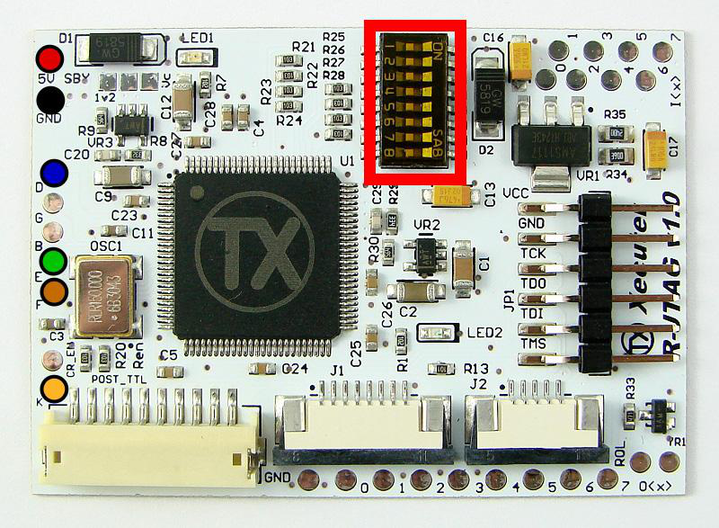

**The steps on this page are considered risky for your console, as there is a chance you can brick it. Please have someone else mod  your console if you are not experienced in soldering!**

------

# R-JTAG Hack

------

The R-JTAG hack is essentially a re-enabling of the JTAG hack using  the reset glitch from RGH, which allows you to run unsigned code, mods,  game backups, and homebrew on phat consoles. The hack relies on  vulnerabilities in dashboard 14719 and later. This should only be used  if your console doesn't work well with RGH 1.2 and RGH 2.0 as it  requires you to buy an R-JTAG kit and has been known to potentially  write garbage to your NAND in some cases. It's recommended to take a  look at the [exploit chart](http://i.imgur.com/c5BVZZO.png) and see what hack is recommended for your console.

While it's recommended to read through this guide in its entirety, a video guide for R-JTAG can be found on [MrMario2011's channel](https://youtu.be/VWC1Hh7WFoo?list=PL1CadovfabPskGb2Ur4kBGzD5s7DzQw5I).

**Note that R-JTAG does not support Xenon or Slim/E motherboards.**

------

## Requirements

Below are the requirements to R-JTAG your Xbox 360. It's recommended  to read ahead and choose the NAND dumping method and R-JTAG specific  wiring method that's right for you, as you will need a NAND programmer  if you choose the R-JTAG Starter Kit and potentially more equipment  depending on which methods you choose.

To check that your console is exploitable, it must meet the following conditions. It must be:

1. A 

   non-Xenon

    fat console (Zephyr, Falcon, Opus, or Jasper model). You can look at the back of your console and check 

   this chart

    to find out what model you have. 

   - If you have a Jasper, determine whether if there is Memory Unit  built in. If it has 214MB of storage, it's a 256MB NAND. If it has 451MB of storage, it is a 512MB NAND.

2. On 

   dashboard 14719 or higher

   . You can check this by navigating to Settings > Console Settings > Hover over System  Info. Your dashboard version will be shown in the top right in the form  2.0.xxxxx.0, where xxxxx is your dashboard version.

   - If it is on a lower dashboard, you can update it to the latest.

3. Soldering experience. The Xbox 360 is not a good place to learn to  solder. Regardless of which dumping method you choose, you will need a  soldering iron, solder, and flux.

4. You will need one of the following R-JTAG kits and the extras listed below it:

##### R-JTAG Ultimate Kit

- [J-Runner](https://www.modconsoles.fr/hitcounter/counter.php?file=JRunner_V0.5.zip)
- Equipment listed in the relevant R-JTAG specific wiring below

##### R-JTAG Starter Kit

- A NAND reader (JR Programmer, NAND-X, Matrix USB NAND Flasher, or LPT cable)
- [J-Runner](https://www.modconsoles.fr/hitcounter/counter.php?file=JRunner_V0.5.zip)
- Equipment listed in the relevant R-JTAG specific wiring below

## Dumping your NAND

There are four different methods to making a dump of your NAND chip:  Nand-X, JR Programmer, Matrix USB NAND Flasher, or a LPT cable. Consider the pros and cons below and choose the method that's right for you.  Once you have decided on a method, select the guide below and follow it  to get a NAND dump, patch the dump, and write the dump to your  motherboard. Once you've completed one of the pages below, continue to  the next section.

| Method                                                       | Pros                                                         | Cons                                                         |
| ------------------------------------------------------------ | ------------------------------------------------------------ | ------------------------------------------------------------ |
| **[Nand-X](https://360.consolemods.org/hardware/programmers/nandx.html)** | *- Dumps NAND faster than JR Programmer; 2-8 minutes* **- Can also program RGH glitchchips** | - More expensive than JR Programmer                          |
| **[JR Programmer](https://360.consolemods.org/hardware/programmers/jrprogrammer.html)** | *- Dumps NAND faster than LPT; 3-10 minutes* **- Can also program RGH glitchchips** | - More expensive than LPT cable                              |
| **[Matrix USB NAND Flasher](https://360.consolemods.org/hardware/programmers/matrix.html)** | *- Cheapest option* **- Dumps NAND at same speed as NAND-X** | - Can't be used for programming RGH glitchchips unless you modify it per the tutorial on it's page. |
| **[LPT Cable](https://360.consolemods.org/hardware/programmers/lpt.html)** | *- Cheap option* **- Old school DIY experience**             | *- More equipment needed* **- Can't be used for programming RGH glitchchips** *- Takes ~30 minutes for a NAND dump, ~150 minutes for large Jasper NANDs* |

## R-JTAG Specific Wiring

Following the wire color scheme, use [this image](http://i.imgur.com/5HlH4R2.jpg) to install the R-JTAG module. The R-JTAG module itself will rest on top of the DVD drive, hanging partially off of the side closest to the back of the console.

On the QSB labelled "JTAG ALT V2", short pins 1 and 3 together, set  the left switch to the ON position, and set the right switch to the  middle (470 ohms) position. Later on, if you have bad boot times, try  switching the right switch to the left position (330 ohms). 

Stick the adhesive backings on the bottom of the QSBs and set them in place on the motherboard. The adhesive is just meant to hold the QSBs  in place as you solder them. Solder all of the QSBs in place as  according to the [picture above](http://i.imgur.com/5HlH4R2.jpg). It should be obvious as to which points will attach to the QSB.

## R-JTAG Module Dip Switches

Configure the DIP switches as follows, only having one "either" switch on at a time:

| Motherboard | 1    | 2    | 3      | 4      | 5      | 6    | 7    | 8    |
| ----------- | ---- | ---- | ------ | ------ | ------ | ---- | ---- | ---- |
| Jasper      | Off  | Off  | Off    | Either | Either | Off  | On   | On   |
| Opus        | Off  | Off  | Either | Either | Either | Off  | On   | Off  |
| Falcon      | Off  | Off  | Either | Either | Either | Off  | On   | Off  |
| Zephyr      | Off  | Off  | On     | Off    | Off    | Off  | Off  | On   |

- Change the "either" switches around if you have bad boot times or  flashing red lights (false RROD), but make sure only one "either" switch is enabled. 

## Creating an XeBuild Image

You should now be able to turn on your Xbox 360 and boot into XeLL  and see your CPU key. With that CPU key, we can build an XeBuild image,  which is a NAND dump built specifically for your console. Ensure that  you have written down your CPU key and have powered off your console.

1. Open JRunner and select "..." next to the Source File field and  select your nanddump1.bin if not already selected. In the upper right  corner of the window, select the dashboard version you chose for the  patched dump that you wrote to the motherboard and make sure that the  "Jtag" radio button is selected, the `R-jtag` box has a check in it, and if you have a non-Xenon console, the `Aud_clamp?` box has a check in it.
2. Select the "Create Image" button in the top left of the window.  It may prompt you for your motherboard model, select it and click OK. It will build your image and save it to a numbered folder within the  JRunner directory as updflash.bin.
   - If you get an error during this step, see the troubleshooting section below.
3. Copy updflash.bin to a FAT32 formatted USB storage device and  plug it into your powered-off console. Turn on your console and it will  boot into XeLL and begin flashing your NAND. Once it has finished, it  will power off your console. Turn it back on, and it should boot to the  Microsoft dashboard, which is an indication that you've successfully  hacked your console. You're now free to install XEXmenu (instructions in section below).

- You may want to leave your Xbox 360 disassembled so that you can:
  - ...[disable the eFuse-blowing circuit](https://360.consolemods.org/repairguide/disableefuseburn.html) so that you can't accidentally install official updates on your console.
  - ...check what it's running temperatures are so that you can judge whether it'd be a good idea to use [cooling mods](https://360.consolemods.org/repairguide/improvecooling.html) to avoid overheating issues. This is recommended for all fat consoles, particularly Xenons.

## Installing XeXMenu

1. Plug a flash drive into your Xbox 360 and navigate to Console  Settings > Storage. Select the flash drive and allow it to format the flash drive as a system drive. 
2. Extract the `CODE9999` folder from the [XeXMenu 1.2 rar](http://www.mediafire.com/file/7orm0jrkncrzo1w/xexmenu12live.rar/file) to your Desktop.
3. Plug the flash drive into your PC. Open [Xplorer360](http://www.mediafire.com/file/zb6ic4036c6nmpg/Xplorer360.exe/file) and select Drive > Open > Harddrive or Memcard. On the left-hand  side, select Partition 3, then right-click the Content folder, select  "New Folder", and name it `0000000000000000` (16 zeroes). Open the new folder, then drag the `CODE9999` folder into it.
4. Select Drive > Close, then close Xplorer360. Safely eject your flash drive and plug it into your Xbox 360. Navigate to the Demos  section of your dashboard, and it should list XeXMenu there. Select it  to launch it. 
   - You can install XeXMenu to your hard drive by going to Console  Settings > Storage, and copying it from your flash drive to the hard  drive.

From here, you can install any homebrew or mods that you want. See [this page](https://360.consolemods.org/modguide/recommendedsetup.html) for a list of recommended modifications and applications to install.