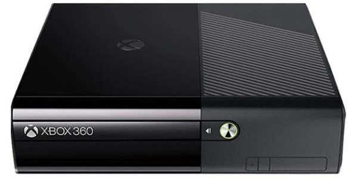

# Identifying Console

### Console Type

## Xbox 360 ("phat") 

Use the [motherboard identification chart](http://i.imgur.com/Dcf9hQ4.png) to determine what kind of motherboard you have.

If you just want to flash your drive, you can flash any phat model and dashboard version following [this guide](https://www.se7ensins.com/forums/threads/█▬►►nooberts-flashing-guide-phat-slim-burner-max-payload-burn-games◄◄▬█.1150969/).

If you want full system access, see the [exploit chart](https://i.imgur.com/mQHFumb.png) to determine what the best hack for your model is if there are multiple options in the box choose the left one.

- If you are on dashboard 7371: If the console manufacture date on the back is BEFORE 6-1-2009 then it is JTAGable, otherwise it is **not**. If you want to be sure that it is exploitable, a NAND dump will be able to tell you what CB (bootloader) version your console is on, as the CBs on some consoles running 7371 differ. The following [chart](http://i.imgur.com/On7Sazo.jpg) details which bootloaders are exploitable by the JTAG/SMC exploit, so  make sure this matches if you wish to double-check via NAND dump.

## Xbox 360 Slim 

Use the [motherboard identification chart](http://i.imgur.com/Dcf9hQ4.png) to determine what kind of motherboard you have. Note the watts (W) and  amperage (A) ratings for each model, and compare it with the one on the  back of the console above the barcode. Generally, Trinity consoles are  glossy, and Coronas are matte; but this is not always the case. 

If you just want to flash your drive, you can do so by following [this guide](https://www.se7ensins.com/forums/threads/█▬►►nooberts-flashing-guide-phat-slim-burner-max-payload-burn-games◄◄▬█.1150969/).

If you want full system access, see the [exploit chart](https://i.imgur.com/mQHFumb.png) to determine what the best hack for your model is.

## Xbox 360 E 

Use the [motherboard identification chart](http://i.imgur.com/Dcf9hQ4.png) to determine what kind of motherboard you have. Note the watts (W) and  amperage (A) ratings for each model, and compare it with the one on the  back of the console above the barcode. Winchester boards can be  differentiated from a Corona board by [looking through the side vent with a flashlight](http://web.archive.org/save/_embed/https://obrazki.elektroda.pl/5184821800_1418893002.jpg) or by looking at the GPU and seeing if it is a [Corona v6](https://weekendmodder.com/images/corona_xcgpu.png) or [Winchester](https://weekendmodder.com/images/winchester_xcgpu.png).

- **A Winchester board is not exploitable in any way. This includes RGH/JTAG, drive flashing, and ODEs.**

If you just want to flash your drive, you can do so by following [this guide](https://www.se7ensins.com/forums/threads/█▬►►nooberts-flashing-guide-phat-slim-burner-max-payload-burn-games◄◄▬█.1150969/).

If you want full system access, see the [exploit chart](https://i.imgur.com/mQHFumb.png) to determine what the best hack for your model is.

### Motherboard

All motherboards except the Winchester motherboard are exploitable with the RGH.

### DVD Drive

### Dashboard/Kernel

