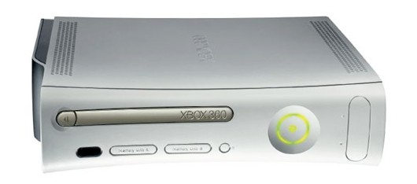
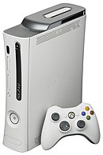
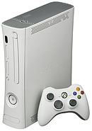
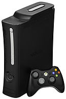
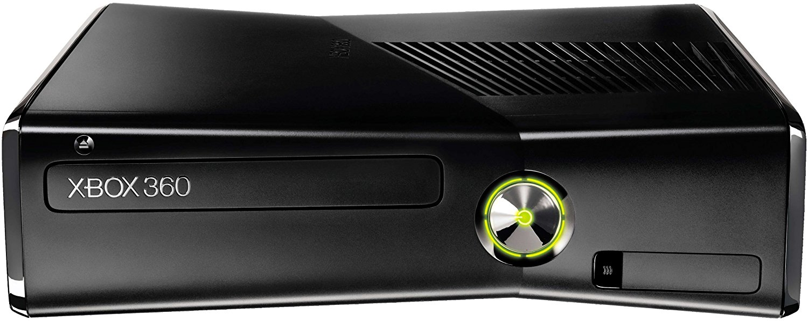
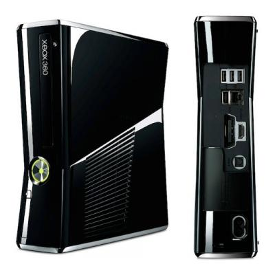
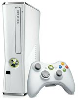
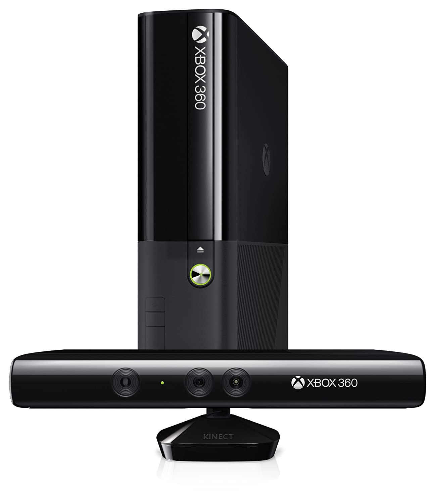
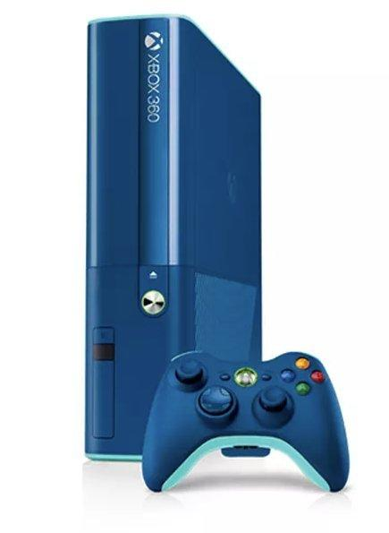

# Identifying Console Model

Identification of console model does not require anything more than a visual inspection of the console itself, as it will be plainly apparent.

## Xbox 360 ("phat") 

This model is the only one with support for Proprietary Xbox 360 Memory Cards and user-friendly replaceable console faceplates. Some of these models include internal NAND storage.

The Xbox 360("phat") was released in various model revisions including:

##### "Premium"/"Pro"

Equipped with a silver-colored DVD drive eject button and DVD drive faceplate, glossy-silver plastic vent side panels, all-white all-matte console shell and faceplate, and a accessory HDD with silver side panels. {1} {2}

##### Core/Arcade

Equipped with all-white all-matte DVD drive eject button, DVD drive faceplate, console shell and faceplate, and matte-grey plastic vent side panels.  {1} {2}

##### Elite

Equipped with an all-black all-matte console shell and faceplate, plastic vent side panels, silver-colored DVD drive eject button and DVD drive faceplate. {3} {4}

##### Limited Editions

This is meant to become an exhaustive list of all official limited edition Xbox 360("phat") consoles. Please add photos and relevant appearance information, bundled items, and any relevant special features/information.

## Xbox 360 S(lim) 

This model has a internal HDD accessory slot, internal 802.11N Wi-Fi module, and some units include internal Flash/NAND storage capacity. These models have a large chrome capacitive-touch power button, a small chrome capacitive-touch eject button, a Kinect port, 5 USB ports, an Ethernet port, HDMI & AV output, optical audio output, and use a S(lim) model PSU.

The Xbox 360 S(lim) was released in various model revisions, including:

##### Black

This is the standard version that was released with an all-black all-glossy case.

##### White

This version also came with a white Kinect and white controller.

##### Limited Editions

This is meant to become an exhaustive list of all official limited edition Xbox 360 S(lim) consoles. Please add photos and relevant appearance information, bundled items, and any relevant special features/information.

## Xbox 360 E 

This model came with a Kinect with an additional Xbox logo as shown. This model came with a all-black all-matte controller with a chrome silver Xbox Guide button. This is the only model of the Xbox 360 with the potential to be unmoddable at the time of writing. This model has a small silver power-button and eject button and came in two revisions: Black(as shown) and:

##### Blue

This model has a blue case with cyan side panels and a blue controller with cyan trim, bumpers, and triggers, blue D-pad and joysticks, and a chrome silver Xbox Guide button.

## Notes

1. Came with standard all-white all-matte controllers with the matte silver Xbox Guide button.
2. Optional all grey accessory HDDs with a silver sticker in center that reads "HDD" or the storage space of the HDD accessory were available.
3. Came with an all-black all-matte controller with the matte silver Xbox Guide button. 
4. Also included a all-black all-matte accessory HDD with silver side panels.

## References

## Credits

Microsoft Corporation for Xbox 360 hardware shown.