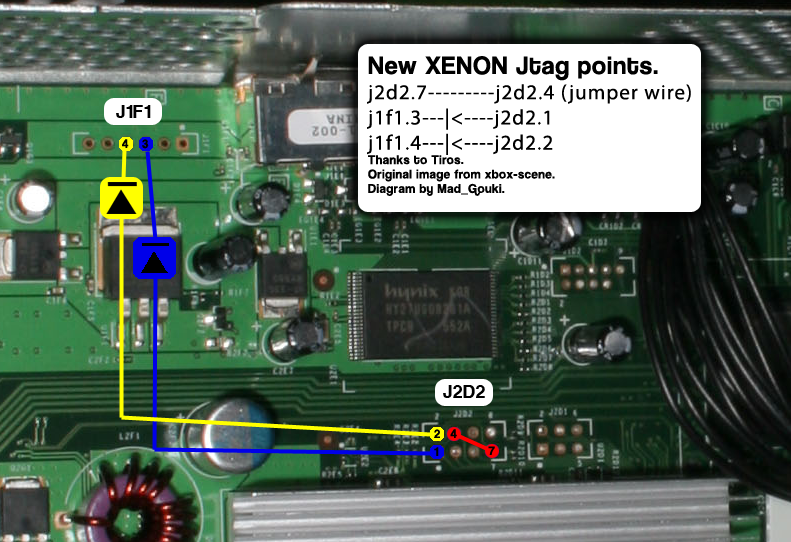

# JTAG Wiring: Xenon Method

------

## Equipment Needed

- A soldering iron, solder, and flux
- Isopropyl alcohol (90% or higher recommended) and cotton swabs
- 28AWG or 30AWG wire
- Two 1N914/4148 switching diodes

## Motherboard Soldering

Cut two strands of wire approximately 6 inches long. Solder one wire  on the end furthest away from the black line on one of the diodes. Using the diagram below for reference, hold the unsoldered end of the diode  against one of the J1F1 points on the board, and cut the wire to the  length needed to comfortably reach one of the J2D2 points. Repeat for  the other diode and solder them in place, making sure that you solder  the diodes directly to the J1F1 points. 

Next, solder a short wire from point 4 to 7 on the J2D2 header. All  points should be solidly connected so that a tug on the wire won't  disconnect the wire. 

## Testing your Console

Once you've finished soldering, clean up any flux with isopropyl  alcohol and cotton swabs. Partially re-assemble your Xbox 360, ensuring  that:

- The motherboard in the metal cage
- Heatsinks are attached (if you removed them for some reason)
- Fans are in place and plugged in
- The white fan shroud is in place
- The Ring of Light board is plugged into the front of your console
- Your video cable (preferably not HDMI) is plugged in
- Your power brick is plugged in to both you wall and Xbox 360

Turn on your console, and it should boot into XeLL within a minute.  At this point, write down (and/or take a picture of) the "CPU Key"  listed on screen, and turn your console off. You can now go back to the  JTAG (or R-JTOP) hack page and continue from the beginning of the [Creating an XeBuild Image](https://www.reddit.com/r/360hacks/wiki/jtag#wiki_creating_an_xebuild_image) section.

- If your console doesn't boot into XeLL, check all previous steps and double check your wiring accuracy and quality.

## Troubleshooting

- **Error: "could not read --_-----.bin (-1)"**
  - Try running JRunner as administrator
  - Make sure that the dashboard files are present in the xeBuild folder in the JRunner directory. It should just be a folder with the dashboard number.
  - Download the common bin pack and merge it with your common folder in the JRunner directory.
- **What should I do if I ripped off a soldering pad?**
  - Look online for an alternate point to solder onto. Practice more on junk electronics before attempting to continue.